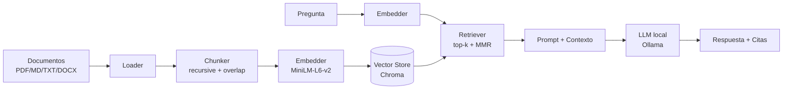

# Local RAG Knowledge Engine

> **Status:** 🚧 Work in Progress — MVP en construcción
> **Última actualización:** 2026-05-04

Motor de Retrieval-Augmented Generation 100% local: ingesta documentos (PDF, Markdown, TXT, DOCX), los trocea, genera embeddings, los indexa en una base vectorial y responde preguntas con citas a la fuente. Sin API keys, sin enviar datos a la nube.

## ¿Por qué este proyecto?

- **Privacidad**: todo corre en local (embeddings + LLM vía Ollama).
- **Aprendizaje**: implementar RAG end-to-end obliga a tomar decisiones reales de chunking, retrieval y prompting.
- **Base extensible**: pensado como cimiento para experimentar con reranking, hybrid search y evaluación.

## Arquitectura



## Stack

| Capa            | Tecnología                          | Por qué                                        |
|-----------------|-------------------------------------|------------------------------------------------|
| Parseo          | `pypdf`, `python-docx`, `markdown-it` | Cubrir formatos comunes sin dependencias pesadas |
| Chunking        | `langchain-text-splitters`          | Recursive splitter probado, fácil de cambiar   |
| Embeddings      | `sentence-transformers` (MiniLM)    | Rápido en CPU, calidad suficiente para MVP     |
| Vector store    | `chromadb`                          | Persistente, cero configuración                |
| LLM             | Ollama (`llama3.2:3b`)              | Local, gratis, sin API key                     |
| CLI             | `typer` + `rich`                    | DX agradable                                   |
| Tests           | `pytest`                            | -                                              |

## Estado actual

- [ ] Scaffolding del proyecto (`pyproject.toml`, estructura `src/`)
- [ ] Loader multi-formato (PDF/MD/TXT/DOCX)
- [ ] Chunker con overlap y metadata (`source`, `page`, `chunk_id`)
- [ ] Embedder envuelto detrás de interfaz
- [ ] Vector store persistente con Chroma
- [ ] CLI: `rag ingest <path>`
- [ ] CLI: `rag ask "<pregunta>"` con citas
- [ ] Modo extractive (sin LLM) como fallback
- [ ] Integración Ollama
- [ ] Tests de chunking y retrieval
- [ ] Eval notebook con preguntas ground-truth

## Roadmap

### v0.1 — MVP (en curso)
Pipeline ingest → chunk → embed → store → retrieve → answer funcionando con citas.

### v0.2 — Calidad de retrieval
- Hybrid search (BM25 + denso) con `rank_bm25`
- Reranking con cross-encoder (`bge-reranker`)
- MMR para diversidad

### v0.3 — Evaluación
- Suite de eval con ~30 Q&A ground-truth
- Métricas: hit@k, MRR, faithfulness, answer relevancy (RAGAS)
- Comparativa de configuraciones (chunk size, k, modelo de embedding)

### v0.4 — Multimodal y estructura
- Extracción de tablas con `unstructured`
- OCR para PDFs escaneados (`pytesseract`)
- Chunking semántico (vs recursive por caracteres)

### v0.5 — Productización
- API REST con FastAPI
- UI con Streamlit
- Dockerfile + docker-compose (app + Ollama)
- Observabilidad básica (latencias por etapa)

## Decisiones de diseño

- **Chroma sobre FAISS**: persistencia y metadata filtering out-of-the-box; FAISS sería más rápido pero requiere infra adicional para metadata.
- **MiniLM-L6-v2**: 22M parámetros, corre en CPU. Para producción real se evaluaría `bge-base-en` o `e5-base`.
- **Chunk size 512 tokens, overlap 64**: punto de partida estándar; se ajustará tras eval.
- **Citas obligatorias**: el prompt fuerza al LLM a citar `[source:page]`. Si no puede, debe responder "no lo sé".

## Limitaciones conocidas

- No maneja tablas ni imágenes (v0.4).
- Chunking por caracteres, no semántico — puede partir oraciones (v0.4).
- Sin reranking, retrieval depende solo de similitud coseno (v0.2).
- No hay eval cuantitativa todavía (v0.3).
- Single-user, sin auth, sin multi-tenant.

## Instalación

> Primera vez aquí? Lee la **[Guía de Inicio Rápido](QUICKSETUP_GUIDE.md)** — cubre todos los sistemas operativos paso a paso con solución de problemas incluida.

### Linux / macOS / WSL

```bash
git clone https://github.com/tu-usuario/local-rag-engine.git
cd local-rag-engine

# Setup automático (crea .venv e instala todo)
chmod +x scripts/setup.sh
./scripts/setup.sh

# Activar entorno
source .venv/bin/activate

# O usar make directamente
make setup
```

### Windows (CMD)

```bat
git clone https://github.com/tu-usuario/local-rag-engine.git
cd local-rag-engine

:: Setup automático
scripts\setup.bat
```

### Windows (PowerShell)

```powershell
git clone https://github.com/tu-usuario/local-rag-engine.git
cd local-rag-engine

# Setup automático
.\scripts\setup.ps1
```

> **Requisito:** Python 3.11 o superior. Descarga desde [python.org](https://www.python.org/downloads/).

## Uso (cuando v0.1 esté listo)

```bash
# Ingestar documentos
rag ingest ./data/sample/

# Preguntar
rag ask "¿Cuál es la conclusión principal del paper sobre X?"

# Ver estado del store
rag status
```

### Comandos útiles (Linux/Mac/WSL)

```bash
make test      # correr tests
make lint      # verificar estilo
make format    # formatear código
make reinstall # borrar .venv y reinstalar desde cero
make clean     # limpiar todo
```

## Estructura

```
local-rag-engine/
├── src/rag/
│   ├── ingest.py     # loaders por extensión
│   ├── chunk.py      # splitter + metadata
│   ├── embed.py      # wrapper sentence-transformers
│   ├── store.py      # interfaz VectorStore + Chroma
│   ├── retrieve.py   # similarity + MMR
│   ├── qa.py         # prompt + Ollama + citas
│   └── cli.py        # entrypoint typer
├── tests/
├── data/sample/
└── notebooks/eval.ipynb
```

## Licencia

MIT
